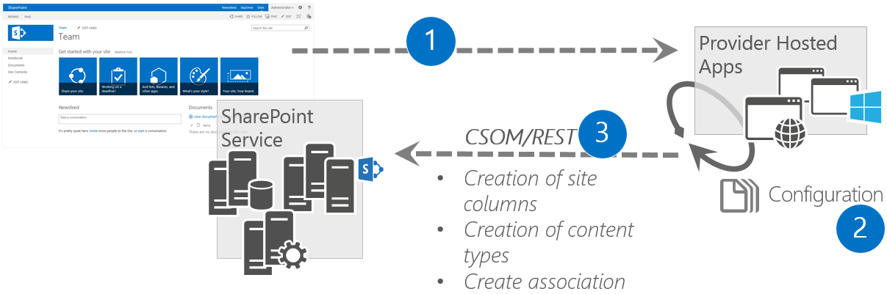

App model recipe - Site Columns and Content Types
=================================================

Summary
-------

The approach you take to create site columns and content types in SharePoint sites is different in the new app model than it was with Full Trust Code.  In a typical Full Trust Code (FTC) scenario, site columns and content types are created with declarative code.

In an app model scenario, site columns and content types are created with the SharePoint Client Side Object Model (CSOM).

High Level Guidelines
---------------------

As a rule of a thumb, we would like to provide the following high level guidelines for creating site columns and content types.

- The SharePoint CSOM should be used to create site columns and content types.
- Feature framework elements should not be used in the creation of site columns and content types.
	+ The only exception to this guideline is when you are using declarative XML based provision to an app web in a SharePoint-hosted app.  This is because the CSOM is not available in a SharePoint-hosted app.
- You can automate the creation of site columns and content types as part of the site provisioning process

Challenges creating site columns and content types in SharePoint sites
----------------------------------------------------------------------

**Creating in a web browser vs. Creating with code** 

It is important to understand that creating site columns and content types via the web browser or via code are different.  This list describes the different options.

- **Creating via a web browser**
	+ In this option, users access a SharePoint site via a web browser and use the Administrative Pages to create site columns and content types.
	+ Usually the only time you will use the web browser to manually create site columns and content types is when you are prototyping or modifying a single SharePoint site that is not planned to grow to include other site collections or sub sites.	+ 
- **Creating with code**
	+ In this option, SharePoint CSOM code is executed to create site columns and content types.
	+ There are a few options you can use to execute the SharePoint CSOM code, they are described later in this article.

When **Creating via a web browser** consider the following points.

- Creating site columns and content types via the web browser is typically a complicated and time consuming process.
	+ These factors make it **prone to error**.
- You do not control the GUIDs for site columns or content types when created via a web browser.
	+ This makes it **difficult** to deploy the site columns and content types to different environments and reference them in line of business applications consistently.

When **Creating with code** consider the following points.

- Creating site columns and content types with code typically involves using custom utility libraries to execute SharePoint CSOM code.
	+ These libraries are available in many projects in the OfficeDev PnP GitHub Repository.  They are referenced throughout the article and at the end.
	+ These factors make it **prone to success**.
- You can control the GUIDs for site columns or content types when created via the SharePoint CSOM.
	+ This makes it **easy** deploy the site columns and content types to different environments and reference them in line of business applications consistently.

**Must happen quickly!**

The creation of site columns and content types typically happens when a SharePoint site is provisioned.  End users won't accept having to wait several hours for their new SharePoint sites to be provisioned.

**Must be consistently perfect!**

Site columns and content types are the foundation which define your information architecture at the lowest level, *they must be perfect*!

Incorrect site column and content type provisioning can affect an entire line of business application in the SharePoint site where they are provisioned as well as other parts of SharePoint and other line of business applications which access SharePoint services.

For example:  If you have SharePoint sites used to manage projects in your company you will most likely create a common list scheme for all of them.  This will require creating site columns and content types.  When you search for information in these sites via the SharePoint search page you filter the results by content type or tag (site column). If your site columns and content types are not perfectly consistent across all the project sites you will not receive accurate search results.

This example may also be applied to Content By Search Web Parts, SharePoint apps, mobile apps, and any other systems which access the information in the SharePoint sites.

Options to create site columns and content types in SharePoint sites
--------------------------------------------------------------------

There are several options you can use to create site columns and content types with the new app model. These options all fall into the **Creating with code** option described above.

- Override the create sub site link
- Use a Provider-hosted app
- Use Windows/Java/iOS applications or PowerShell scripts

Override the create sub site link
---------------------------------

In this pattern the link to create a sub site is overridden with a link that points to a Provider-hosted app.  CSOM code running in a Provider-hosted app is executed via the remote provisioning pattern as part of the site creation process.
 
The pattern looks like this:

- The pattern is only used when targeting sub site creation, it is not used to create site collections.
- The override URL is configured in the SharePoint admin center
- Provider-hosted app uses CSOM APIs to create site columns and content types
	+ CSOM/REST APIs may also be used to configure other aspects of the site during the provisioning process
- This approach may be used in Office 365 tenants and in on-premises SharePoint
- Provides a tremendous amount of flexibility to create and configure SharePoint sites
- Easy and inexpensive to implement and maintain in the short and long term

**Configuration**

To override the create sub site link open the settings page in the SharePoint admin center (shown below).

Then, check the Use the form at this URL checkbox and enter the URL to the Provider-hosted app which implements the sub site creation functionality (shown below).

Notice  SharePoint warns you (in the dialog below) about the security implications associated with this approach and provides you with an option to disable this type of functionality.

**When is it a good fit?**

This option works well when you need to provide your end users with a self-service ability to create SharePoint sub sites based on custom templates.

**Getting Started**

The following articles describe the override create sub site link pattern and provide code samples to get you started.  *It is important to note that these 3 samples do not show how to create site columns or content types, those samples are listed later int he article.  Keep in mind you can take the code to create site columns and content types and use it inside these samples though.*

- [Self-Service Site Provisioning using Apps for SharePoint 2013 (MSDN Blog)](http://blogs.msdn.com/b/richard_dizeregas_blog/archive/2013/04/04/self-service-site-provisioning-using-apps-for-sharepoint-2013.aspx)
	+ End to end article about this pattern with accompanying video.
- [Provisioning.Cloud.Sync (O365 PnP Sample)](https://github.com/OfficeDev/PnP/tree/master/Solutions/Provisioning.Cloud.Sync)
	+ This solution shows the model for providing synchronous site collection or sub site creation experience to introduce model for site templates without using actual sandbox solutions or stp files. 
- [Provisioning.SubSiteCreationApp (O365 PnP Sample)](https://github.com/OfficeDev/PnP/tree/master/Samples/Provisioning.SubSiteCreationApp)
	+ This solution uses so called remote provisioning pattern to provide as flexible sub site template system as possible.  It also includes an accompanying video.

Use a Provider-hosted app
-------------------------

In this pattern, CSOM code running in a Provider-hosted app is executed via the remote provisioning pattern as part of the site creation process.
 
- The pattern may be used to target site collection and sub site creation
- The SharePoint-hosted app must be granted Full Control permissions to the SharePoint environment
	+ You cannot use this pattern in the Microsoft Marketplace because it requires Full Control permissions
- Provider-hosted app uses CSOM APIs to create site columns and content types
	+ CSOM/REST APIs may also be used to configure other aspects of the site during the provisioning process
- This approach may be used in Office 365 tenants and in on-premises SharePoint
- Provides a tremendous amount of flexibility to create and configure SharePoint sites
- Easy and inexpensive to implement and maintain in the short and long term

**When is it a good fit?**

This option works well when you need to provide your end users with a self-service ability to create SharePoint site collections and sub sites based on custom templates.  *Note that you will need to provide your users a link to the Provider-hosted application so they can access it.*

- [Provisioning.Services.SiteManager (O365 PnP Sample)](https://github.com/OfficeDev/PnP/tree/master/Samples/Provisioning.Services.SiteManager)
	+ This sample shows how to extend on-premises farm to support site collection creation from a Provider-hosted app.
- [Provisioning.SiteCollectionCreation (O365 PnP Sample)](https://github.com/OfficeDev/PnP/tree/master/Samples/Provisioning.SiteCollectionCreation)
	+ Demonstrates how to create site collections using CSOM for Office 365 from a Provider-hosted app.
- [Core.ContentTypesAndFields (O365 PnP Sample)](https://github.com/OfficeDev/PnP/tree/dev/Scenarios/Core.ContentTypesAndFields)
	+ Demonstrates how to create a new content type in the host web, create a taxonomy field in the host web and wire it up to the taxonomy, create a list and associate it with a content type, create content types and fields in particular languages.

Use Windows/Java/iOS applications or PowerShell scripts
-------------------------------------------------------

In this pattern, CSOM code is executed via Windows/Java/iOS applications or PowerShell scripts.
 
- The pattern may be used to target site collection and sub site creation
- The apps must be granted Full Control permissions to the SharePoint environment	
- Authentication can be a challenge depending on the type of app you are creating and your SharePoint security settings
- Provider-hosted app uses CSOM APIs to create site columns and content types
	+ CSOM/REST APIs may also be used to configure other aspects of the site during the provisioning process
- This approach may be used in Office 365 tenants and in on-premises SharePoint
- Provides a tremendous amount of flexibility to create and configure SharePoint sites
- Easy and inexpensive to implement and maintain in the short and long term

**When is it a good fit?**

This option works well in Dev-Ops scenarios. It allows you to create custom applications or scripts that are specifically built to work with your Dev-Ops processes. This option provides the ultimate level of automation because the apps and scripts can be built to run without any user interaction.  

- [Core.CreateContentTypes (O365 PnP Sample)](https://github.com/OfficeDev/PnP/tree/dev/Samples/Core.CreateContentTypes)
	+ This sample shows how you can create site columns, content types and add then add the site columns to the content type. It will also explain the new localization features that have been introduced for Office 365 CSOM APIs.
- [Core.CreateDocumentContentType (O365 PnP Sample)](https://github.com/OfficeDev/PnP/tree/dev/Samples/Core.CreateDocumentContentType)
	+ This sample shows how you can create document content types and add then associate a document template to the content type.

More Examples
-------------

- [Branding.DisplayTemplates (O365 PnP Sample)](https://github.com/OfficeDev/PnP/tree/master/Samples/Branding.DisplayTemplates)
	+ The Display Templates sample demonstrates how to use Display Templates to render a hero image and content rotator in a Content By Search Web Part. Additionally, the Display Templates target mobile devices using Responsive Web Design (RWD) and Device Channels.
	+ The [code behind for the default.aspx web page](https://github.com/OfficeDev/PnP/blob/master/Samples/Branding.DisplayTemplates/Branding.DisplayTemplatesWeb/Pages/Default.aspx.cs) is an excellent easy to follow example that demonstrates how to create a list, create a content type for the list, bind site columns to the content type, bind the content type to the list, upload control and item template JS files to the master page gallery, upload master pages, create pages and add content and web parts to the pages, and initialize list data.  
- [Core.DataStorageModels (O365 PnP Sample)](https://github.com/OfficeDev/PnP/tree/master/Samples/Core.DataStorageModels)
	+ This Provider-hosted sample application for SharePoint demonstrates the differences, advantages, and disadvantages between different data storage patterns associated with the App Model and how they are built. It also illustrates limitations associated with certain data storage components that should be considered when deciding which data storage components to use when building with the App Model.  
	+ The [Util class](https://github.com/OfficeDev/PnP/blob/master/Samples/Core.DataStorageModels/Core.DataStorageModelsWeb/Util/Util.cs) includes reusable methods which may be used to create site columns and content types.  
	+ The [SharePointService class](https://github.com/OfficeDev/PnP/blob/master/Samples/Core.DataStorageModels/Core.DataStorageModelsWeb/Services/SharePointService.cs)  includes methods which demonstrate how to create lists, content types, and site columns and many other related operations.

Related links
=============
- [Self-Service Site Provisioning using Apps for SharePoint 2013 (MSDN Blog)](http://blogs.msdn.com/b/richard_dizeregas_blog/archive/2013/04/04/self-service-site-provisioning-using-apps-for-sharepoint-2013.aspx)
- Guidance articles at [http://aka.ms/OfficeDevPnPGuidance](http://aka.ms/OfficeDevPnPGuidance "Guidance Articles")
- References in MSDN at [http://aka.ms/OfficeDevPnPMSDN](http://aka.ms/OfficeDevPnPMSDN "References in MSDN")
- Videos at [http://aka.ms/OfficeDevPnPVideos](http://aka.ms/OfficeDevPnPVideos "Videos")

Related PnP samples
===================

- [Provisioning.Cloud.Sync (O365 PnP Sample)](https://github.com/OfficeDev/PnP/tree/master/Solutions/Provisioning.Cloud.Sync)
- [Provisioning.SubSiteCreationApp (O365 PnP Sample)](https://github.com/OfficeDev/PnP/tree/master/Samples/Provisioning.SubSiteCreationApp)
- [Provisioning.Services.SiteManager (O365 PnP Sample)](https://github.com/OfficeDev/PnP/tree/master/Samples/Provisioning.Services.SiteManager)
- [Provisioning.SiteCollectionCreation (O365 PnP Sample)](https://github.com/OfficeDev/PnP/tree/master/Samples/Provisioning.SiteCollectionCreation)
- [Core.ContentTypesAndFields (O365 PnP Sample)](https://github.com/OfficeDev/PnP/tree/dev/Scenarios/Core.ContentTypesAndFields)
- [Core.CreateContentTypes (O365 PnP Sample)](https://github.com/OfficeDev/PnP/tree/dev/Samples/Core.CreateContentTypes)
- [Core.CreateDocumentContentType (O365 PnP Sample)](https://github.com/OfficeDev/PnP/tree/dev/Samples/Core.CreateDocumentContentType)
- [Branding.DisplayTemplates (O365 PnP Sample)](https://github.com/OfficeDev/PnP/tree/master/Samples/Branding.DisplayTemplates)
- [Core.DataStorageModels (O365 PnP Sample)](https://github.com/OfficeDev/PnP/tree/master/Samples/Core.DataStorageModels)
- Samples and content at https://github.com/OfficeDev/PnP

Applies to
==========
- Office 365 Multi Tenant (MT)
- Office 365 Dedicated (D) *partly*
- SharePoint 2013 on-premises – *partly*

*Patterns for dedicated and on-premises are identical with app model techniques, but there are differences on the possible technologies that can be used.*

Author
------
Todd Baginski (Canviz LLC) - [@toddbaginski](https://twitter.com/toddbaginski)

Version history
---------------
Version  | Date | Comments | Author
---------| -----| ---------| ------
0.1  | April 2, 2015 | Initial draft | Todd Baginski (Canviz LLC)

