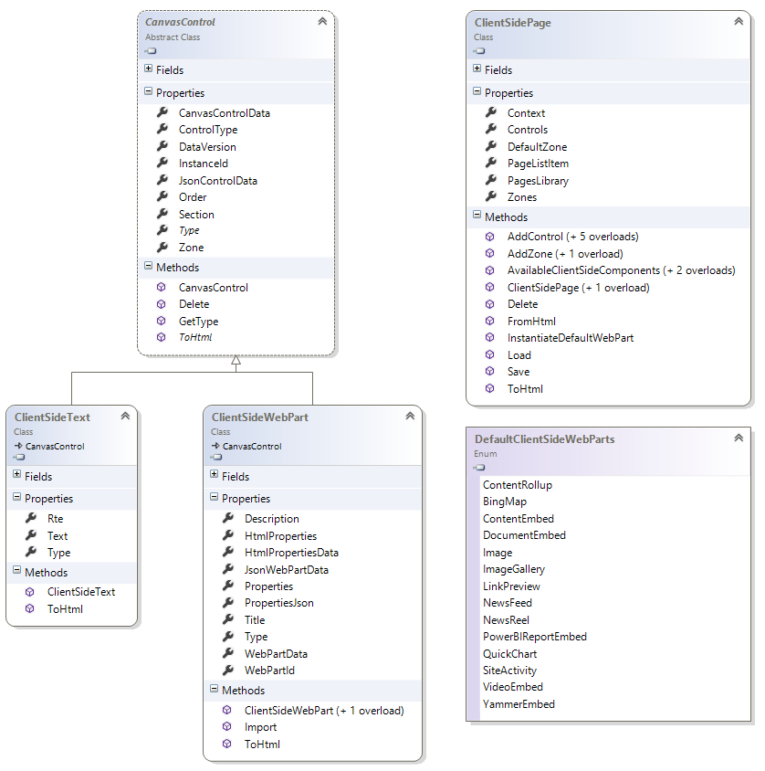

# Customizing "modern" site pages
During the autumn of 2016 the "modern" page experience was released by the SharePoint team. Modern team site pages are fast, easy to author, and support rich multimedia content. Additionally, pages look great on any device, in a browser or from within the SharePoint mobile app. SharePoint pages are built with web parts, which you can customize according to your needs. You can add documents, videos, images, site activities, Yammer feeds, and more. Just click the + sign and pick a web part from the toolbox to add content to your page. The new “highlighted content” web part lets you set criteria so that specific content will automatically and dynamically populate in that area of the page. And using the SharePoint Framework, developers can build custom web parts that will show up right in the toolbox.


This article focuses on the extensibility options within the "modern" page experience. If you, however, want to learn more about the functionalities offered by the "modern" experiences, then the following link will help:
 - New capabilities in SharePoint Online team sites: https://blogs.office.com/2016/08/31/new-capabilities-in-sharepoint-online-team-sites-including-integration-with-office-365-groups

In the remainder of this article we'll use "modern" for the new user experience and "classic" for the legacy user experience. 

>**Important:** 
We're not deprecating the "classic" experience - both "classic" and "modern" will coexist.

_**Applies to:** SharePoint Online_


## Supported customizations for "modern" pages
The number of customizations available for "modern" pages is limited and in this article we'll provide details and examples of the supported options. The SharePoint team is working to support more options in the future. The list below gives a quick overview of the supported capabilities for "modern" team sites:
 - Custom branding
 - Adding "modern" pages programmatically
 - Adding, deleting, updating client side web parts on "modern" pages

There are numerous customizations which currently are not supported for "modern" pages:
 - Alternative layouts -  We are looking to have support for multiple canvases in the future
 - Custom page templates (layout templates) - We are looking to have support for multiple canvases in the future
 - Adding "classic" web parts on "modern" pages
 - Custom CSS via AlternateCSSUrl web property
 - Custom JavaScript embedded via User Custom Actions - There will a be more controlled way to embed JavaScript on the pages through SharePoint Framework (not only client-side web parts)
 - Custom master pages - More extensive branding will be supported later using alternative options
 - Minimal Download Strategy (MDS)
 - SharePoint Server Publishing

## Custom branding
<a name="themingimpact"> </a>
If your site happens to use a custom theme, then this custom theme will be respected in the "modern" page experience as shown in the sample below:


## How to configure the end user experience
<a name="configuremodernpages"> </a>
You have multiple options to control whether the "modern" or "classic" page experience will be used. 

### Tenant level configuration
If you want to completely disable the "modern" experience, then it's best to use the tenant setting for this. Navigate to your tenant admin center (e.g. contoso-admin.sharepoint.com), go to settings, and select the "classic" experience:


>**Notes:**
> - The tenant level setting can be a little confusing: "Preventing users from creating Site Pages" will actually bring back the "classic" experience.
> - The current configuration is cached, logging off the session will immediately show the effect of this change.

### Site level configuration
You can prevent a web from using the "modern" page experience by disabling the web scoped feature with ID **B6917CB1-93A0-4B97-A84D-7CF49975D4EC**. To re-enable the "modern" page experience at the web level you'll need to activate the feature again.

You can use the [PnP provisioning XML](https://msdn.microsoft.com/en-us/pnp_articles/pnp-provisioning-engine-and-the-core-library) below to **disable** this feature on your site:

```XML
<pnp:ProvisioningTemplate ID="disablemodernpages" Version="1" xmlns:pnp="http://schemas.dev.office.com/PnP/2015/12/ProvisioningSchema">
  <pnp:Features>
    <pnp:WebFeatures>
      <pnp:Feature ID="B6917CB1-93A0-4B97-A84D-7CF49975D4EC" Deactivate="true" Description="Enable modern page experience"/>
    </pnp:WebFeatures>
  </pnp:Features>
</pnp:ProvisioningTemplate>
```

You can use the [PnP provisioning XML](https://msdn.microsoft.com/en-us/pnp_articles/pnp-provisioning-engine-and-the-core-library) below to **enable** this feature on your site collection:

```XML
<pnp:ProvisioningTemplate ID="enablemodernpages" Version="1" xmlns:pnp="http://schemas.dev.office.com/PnP/2015/12/ProvisioningSchema">
  <pnp:Features>
    <pnp:WebFeatures>
      <pnp:Feature ID="B6917CB1-93A0-4B97-A84D-7CF49975D4EC" Description="Enable modern page experience"/>
    </pnp:WebFeatures>
  </pnp:Features>
</pnp:ProvisioningTemplate>
```

Use the following PnP PowerShell to apply this template:

```PowerShell

# Connect to a previously created Modern Site
$cred = Get-Credential
Connect-PnPOnline -Url https://[tenant].sharepoint.com/sites/siteurl -Credentials $cred

# Apply the PnP provisioning template
Apply-PnPProvisioningTemplate -Path c:\experiencecontrol.xml -Handlers Features

```

## Programming "modern" pages
### Adding "modern" pages
Creating a "modern" page comes down to creating a list item in the site pages library and assinging it the correct content type combined with setting some additional properties as shown in below code snippet:

```C#
// pagesLibrary is List object for the "site pages" library of the site
ListItem item = pagesLibrary.RootFolder.Files.AddTemplateFile(serverRelativePageName, TemplateFileType.ClientSidePage).ListItemAllFields;

// Make this page a "modern" page
item["ContentTypeId"] = "0x0101009D1CB255DA76424F860D91F20E6C4118";
item["Title"] = System.IO.Path.GetFileNameWithoutExtension("mypage.aspx");
item["ClientSideApplicationId"] = "b6917cb1-93a0-4b97-a84d-7cf49975d4ec";
item["PageLayoutType"] = "Article";
item["PromotedState"] = "0";
item["CanvasContent1"] = "<div></div>"
item["BannerImageUrl"] = "/_layouts/15/images/sitepagethumbnail.png";
item.Update();
clientContext.Load(item);
clientContext.ExecuteQuery();

```

When using PnP (as of March 2017 release) you can leverage our extension methods resulting in an really easy model to add a page:

```C#
cc.Web.AddClientSidePage("mypage.aspx", true);
```

### Introduction into the "modern" page model
As described in the previous chapter a "modern" page essentially is row in the site pages library with the right content type and properties set. In this chapter we'll be explaining the **CanvasContent1** property as that's the one holding the information about the page structure and the client side web parts hosted on the page.

#### Basic page structure
The most elementary empty page can be constructed like this:

```Html
<div>
</div>
```

#### Adding a  control to a page
Let's start with showing a sample and then discuss it:

```Html
<div>
    <div data-sp-canvascontrol="" data-sp-canvasdataversion="1.0" data-sp-controldata="{&quot;controlType&quot;:4,&quot;id&quot;:&quot;4eae4f30-3a40-4a36-bd2a-3de2b0705d54&quot;,&quot;editorType&quot;:&quot;CKEditor&quot;}">
	-- content removed for clarity reasons --
    </div>
</div>
```

**Important concepts** to understand are:
- Controls on page are nested inside the page div using the control div element. A control div is identified via the data-sp-canvascontrol, data-sp-canvasdataversion and data-sp-controldata attributes
	- **data-sp-canvascontrol** is empty as it's used to identify the div
	- **data-sp-canvasdataversion** describes the version of the "serialization model", currently we're at 1.0
	- **data-sp-controldata** contains json serialized information about the control hosted inside...actual content depends on the hosted control type as discussed in the next chapters
- The order of the control div's determines the ordering of rendering
- Inside the control div you'll find the actual web part or rich text control markup


#### Adding a rich text editor control

```Html
<div>
    <div data-sp-canvascontrol="" data-sp-canvasdataversion="1.0" data-sp-controldata="{&quot;controlType&quot;:4,&quot;id&quot;:&quot;4eae4f30-3a40-4a36-bd2a-3de2b0705d54&quot;,&quot;editorType&quot;:&quot;CKEditor&quot;}">
        <div data-sp-rte="">
            <p>Hi <strong>there</strong></p>
            <p>Second <strong>line</strong></p>
            <ul>
                <li><strong>a</strong></li>
                <li><strong><i>b</i></strong></li>
            </ul>
            <p>​​​​​​​<strong><i>cool</i></strong></p>
        </div>
    </div>
</div>
```

**Important concepts** to understand are:
- The rich text editor control markup is a div tag with the **data-sp-rte** attribute. This markup is always hosted inside a control div tag
- The **data-sp-controldata** json for a rich text editor contains these properties:
	- **controlType** indicates its a rich text editor control and must be set to 4
	- **id** refers to the control id which is a guid that uniquely identifies this control instance
	- **editorType** defines the used editor and must be set to **CKEditor**

```json
{"controlType":4,"id":"4eae4f30-3a40-4a36-bd2a-3de2b0705d54","editorType":"CKEditor"}
```

- The actual rich text markup is added as HTML markup inside the rich text editor control div


#### Adding a client side web part

```Html
<div>
    <div data-sp-canvascontrol="" data-sp-canvasdataversion="1.0" data-sp-controldata="{&quot;controlType&quot;:3,&quot;webPartId&quot;:&quot;d1d91016-032f-456d-98a4-721247c305e8&quot;,&quot;id&quot;:&quot;7457b50c-aad3-4520-b4de-44d9ee9bbdc2&quot;}">
        <div data-sp-webpart="" data-sp-webpartdataversion="1.0" data-sp-webpartdata="{&quot;id&quot;:&quot;d1d91016-032f-456d-98a4-721247c305e8&quot;,&quot;instanceId&quot;:&quot;7457b50c-aad3-4520-b4de-44d9ee9bbdc2&quot;,&quot;title&quot;:&quot;Image&quot;,&quot;description&quot;:&quot;Draw people's attention by adding images to your page.&quot;,&quot;dataVersion&quot;:&quot;1.0&quot;,&quot;properties&quot;:{&quot;imageSourceType&quot;:2,&quot;altText&quot;:&quot;&quot;,&quot;fileName&quot;:&quot;webhook-azure-function4.png&quot;,&quot;siteId&quot;:&quot;c827cb03-d059-4956-83d0-cd60e02e3b41&quot;,&quot;webId&quot;:&quot;9fafd7c0-e8c3-4a3c-9e87-4232c481ca26&quot;,&quot;listId&quot;:&quot;78d1b1ac-7590-49e7-b812-55f37c018c4b&quot;,&quot;uniqueId&quot;:&quot;3c27a419-66d0-4c36-bf24-bd6147719052&quot;,&quot;imgWidth&quot;:1002,&quot;imgHeight&quot;:469}}">
            <div data-sp-componentid="">d1d91016-032f-456d-98a4-721247c305e8</div>
            <div data-sp-htmlproperties=""></div>
        </div>
    </div>
</div>
```

**Important concepts** to understand are:
- The client side web part markup is a div tag with the **data-sp-webpart** attribute. This markup is always hosted inside a control div tag
- The **data-sp-controldata** json for a client side web part contains these properties:
	- **controlType** indicates its a client side web part and must be set to 3
	- **id** refers to the control id which is a guid that uniquely identifies this control instance
	- **webPartId** defines the id that identifies the used client side web part
	
```json
{"controlType":3,"webPartId":"d1d91016-032f-456d-98a4-721247c305e8","id":"7457b50c-aad3-4520-b4de-44d9ee9bbdc2"}
```
- The actual text to show is represented as HTML markup inside the rich text editor control div
	- **data-sp-webpart** is empty as it's used to identify the div
	- **data-sp-webpartdataversion** describes the version of the "serialization model", currently we're at 1.0
	- **data-sp-webpartdata** describes the web part parameters. Correctly setting these parameters is important to ensure the client side web works as desired:
		- **id** again identifies the the used client side web part (identical the webPartId in the data-sp-controldata json)
		- **instanceId** refers to the unique control id (identical the id in the data-sp-controldata json)
		- **title** is the web part title
		- **description** is the web part description
		- **dataVersion** describes the version of the "serialization model", currently we're at 1.0
		- **properties** describe the client side web part settings. **The actual properties depend on the used web part**, below sample shows the properties for the out of the box image client side web part

```json
{"id":"d1d91016-032f-456d-98a4-721247c305e8","instanceId":"7457b50c-aad3-4520-b4de-44d9ee9bbdc2","title":"Image","description":"Draw people's attention by adding images to your page.","dataVersion":"1.0","properties":{"imageSourceType":2,"altText":"","fileName":"webhook-azure-function4.png","siteId":"c827cb03-d059-4956-83d0-cd60e02e3b41","webId":"9fafd7c0-e8c3-4a3c-9e87-4232c481ca26","listId":"78d1b1ac-7590-49e7-b812-55f37c018c4b","uniqueId":"3c27a419-66d0-4c36-bf24-bd6147719052","imgWidth":1002,"imgHeight":469}}
```

- The web part div also has 2 nested div elements:
	- The div with the **data-sp-componentid** attribute contains the id that identifies the used client side web part (identical the webPartId in the data-sp-controldata json)
	- The div with the **data-sp-htmlproperties** attribute will hold the specific client side web part html. You'll not need to populate this data as it's the control's responsibility to do this

### Using the PnP support for "modern" pages and client side web parts
As of the [March 2017 release the PnP Sites core library](http://aka.ms/sppnp) offers support for creating, updating and deleting client side pages. This chapter will give you insight in how to work with client side pages using the [PnP Sites core library](https://github.com/SharePoint/PnP-Sites-Core).

#### Creating a new page and adding a text web part
In this sample we create a new client side page in memory, add a rich text editor control and finally save the page to the site pages library as mypage.aspx. First step is creating a ClientSidePage instance, then we instantiate a control which we add on the page using the `AddControl` method. Once that's done the page will be saved.

```C#
// cc is the ClientContext instance for the site you're working with
ClientSidePage myPage = new ClientSidePage(cc);

ClientSideText txt1 = new ClientSideText() { Text = "PnP Rocks" };
myPage.AddControl(txt1, 0);
myPage.Save("mypage.aspx");
```

#### Loading an existing page 
When you want to modify or copy and existing page then you can load that page into the PnP client side object model: the loading will "transform" the html content into a object model that you can manipulate. Loading an existing page is done using the `Load` method

```C#
// load the page with name "page3.aspx"
ClientSidePage p = ClientSidePage.Load(cc, "page3.aspx");

// perform your page updates
...

// save the page back to SharePoint
p.Save()
```

#### Adding an out of the box web part 
Below sample shows how you can add an out of the box **image** client side web part on a page. Note that we instantiate the web part object using the `InstantiateDefaultWebPart` method call. Once the web part is initiated its properties are set to the default properties defined in the web part manifest. For most web parts you'll need to update the properties as shown in below sample.

```C#
ClientSidePage page5 = new ClientSidePage(cc);
var imageWebPart = page5.InstantiateDefaultWebPart(DefaultClientSideWebParts.Image);
imageWebPart.Properties["imageSourceType"] = 2;
imageWebPart.Properties["siteId"] = "c827cb03-d059-4956-83d0-cd60e02e3b41";
imageWebPart.Properties["webId"] = "9fafd7c0-e8c3-4a3c-9e87-4232c481ca26";
imageWebPart.Properties["listId"] = "78d1b1ac-7590-49e7-b812-55f37c018c4b";
imageWebPart.Properties["uniqueId"] = "3C27A419-66D0-4C36-BF24-BD6147719052";
imageWebPart.Properties["imgWidth"] = 1002;
imageWebPart.Properties["imgHeight"] = 469;
page5.AddControl(imageWebPart);
page5.Save("page5.aspx");

```

#### Adding a custom client side web part
Previous samples showed how to work with out of the box web parts, but obviously you can also add your custom built client side web parts to a page. You would start from getting your web part information using the `AvailableClientSideComponents` method, then you search for your web part and use the found information to instantiate a `ClientSideWebPart` instance which in a last step will be added to the page.

```C#
ClientSidePage p = new ClientSidePage(cc);

// get a list of possible client side web parts that can be added
var components = p.AvailableClientSideComponents();

// Find our custom "HelloWord" web part
var myWebPart = components.Where(s => s.ComponentType == 1 && s.Name == "HelloWorld").FirstOrDefault();
if (myWebPart != null)
{
    // Instantiate a client side web part from our found web part information
    ClientSideWebPart helloWp = new ClientSideWebPart(myWebPart) { Order = 10 };
    // Add the custom client side web part to the page
    p.AddControl(helloWp);
}

// Persist the page to SharePoint
p.Save("PnPRocks.aspx");
```

#### Adjusting control order
You have different methods to control the order in which the controls will appear on the page. The key aspect is the `Order` attribute on the actual control: the list of controls is sorted by the value of that `Order` attribute when the page html is generated...and the order in the html is also the order at page rendering time.

```C#
// Set the order when initiating the control
ClientSideText txt1 = new ClientSideText() { Text = "PnP Rocks", Order = 5 };

// Set the order when you add the control to the page, in this case we want the control to be the first
myPage.AddControl(txt1, -1);

// Manipulate the control order on the page...e.g. move a control to the back
myPage.Controls[1].Order = 10;

```

#### Deleting a control
If you want to delete a control from a page you can simply call the `Delete` method on the control and save the page back.

```C#
ClientSidePage deleteDemoPage = ClientSidePage.Load(cc, "page3.aspx");
deleteDemoPage.Controls[0].Delete();
deleteDemoPage.Save();
```

#### Deleting a page 
Finally you can also delete a client side page.

```C#
ClientSidePage p = ClientSidePage.Load(cc, "deleteme.aspx");
p.Delete();
```

#### Class model
Below picture shows the most important classes you'll be working with when using the PnP client side page object model.



## Additional Considerations
<a name="sectionSection22"> </a>

We'll gradually introduce more customization options for the "modern" pages experience. These options will be aligned with the release of additional SharePoint framework capabilities. Currently there is no exact schedule available, but we'll be updating the "modern" experience articles whenever new capabilities are released.

## Additional resources
<a name="bk_addresources"> </a>

 - [Allow or prevent creation of site pages by end users](https://support.office.com/en-us/article/Allow-or-prevent-creation-of-site-pages-by-end-users-c41d9cc8-c5c0-46b4-8b87-ea66abc6e63b?ui=en-US&rs=en-US&ad=US)
