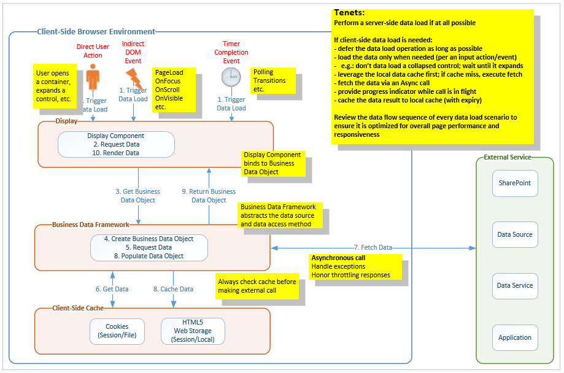

# Proven Practices for SharePoint Online Portals - Performance

Every portal design includes at least one aspect that requires the customization of SharePoint. The customization model for SharePoint Online portals is the SharePoint Add-in Model, which is a distributed application architecture that can encompass a number of execution environments: SharePoint Online, Web Hoster(s), Service Provider(s), and the Client Browser. This architecture is predicated on the concept of client-to-server data requests.

The SharePoint Add-in Model (and its distributed architecture) now places an even greater emphasis on effective design and development for web applications in general, and client-side web applications in particular, especially when it comes to the concept of application performance.

>**Note**:
>Although this guidance primarily targets SharePoint Online, most of it also applies to portals hosted in an on-premises SharePoint environment.

_**Applies to:** SharePoint Online_

## Anti-Patterns (in other words, don't do these things)

If you wish to have performance problems with SharePoint in general, and your custom Portal in particular, consider the following Anti-Pattern:

- Build a custom portal home page for a large enterprise (50,000 users)
- Force lots of traffic to the page by mandating that all browsers open the portal page by default
- Build custom client-side controls that issue client-side data requests to SharePoint and add a dozen or more of them to the page
- Embed redundant custom JavaScript and CSS throughout the page body
- Embed several 10MB thumbnail images throughout the page body
- Execute all client-side data requests at page load time, even if the data is not initially needed/displayed, even if it might never be used
- Inject unnecessary order dependencies into the data request sequence and use **synchronous** data requests to ensure the order of execution
- Use the legacy SharePoint Lists (SOAP) web service as the data request API of choice and pass it poorly-formed CAML queries
- Avoid caching data responses (especially for static data) on the client to ensure that each data request gets re-executed on every page load
- Perform hundreds of updates to the Document Object Model (DOM) of the page as each data response completes, even if they are redundant or conflicting

## Introduction

The SharePoint Online customization model has evolved from the classic, server-based model where custom code executes on the server and performs server-side data requests into a modern, client-based model where custom code runs remotely and performs client-side data requests.  The natural solution architecture for this model is the distributed client-side web application.

A consequence of the distributed client-side web application model, aside from an increase in the inherent complexity of the new custom solution, is a significant increase in client-to-server network traffic associated with the new custom solution and a greater dependency upon the client-side execution environment.

Consider the following comparison of the page load sequence associated with each web application model:

### Classic server-side web application sequence

- First visit to page
	- issue page request
	- issue resource file requests (zero or more)
	- execute some JavaScript
- Return visit to page
	- issue page request
	- execute some JavaScript

### Modern client-side web application sequence

- First visit to page
	- issue page request
	- issue resource file requests (zero or more)
	- execute some JavaScript
	- issue data requests (zero or more)
	- execute more and more JavaScript
- Return visit to page
	- issue page request
	- execute some JavaScript
	- issue data requests (zero or more)
	- execute more and more JavaScript

A network monitor will show that a modern web page can easily cause an order-of-magnitude increase in network traffic as compared to that of a classic web page. A browser-based execution profiler will also show that a modern web page has a greater dependency upon the execution of client-side JavaScript.  Granted, these increases are a function of the design and implementation of the new solution, but the probability of a significant increase is high.

## General Performance Guidelines for Client-Side Web Applications

Once you commit to building a custom client-side web application:

- Acknowledge that you are now responsible for the client-side performance of that application
- Acknowledge that the benefits of server-side rendering and caching are no longer available for your custom controls
- Understand that your application must now provide well-performing, client-side equivalents

>**From a performance perspective**: The goal with modern web applications in general, and client-side web applications in particular, is to implement the client-side logic necessary to mimic the minimal network traffic patterns observed for *return* visits to classic web pages.

The following sections provide performance guidance for achieving this goal.

### Telemetry

Performance is often viewed in subjective terms by end-users. However, it is rather challenging to definitively resolve issues such as "The portal is slow".  In order to quantify perceived performance issues, it is critical to obtain objective metrics for the client-side web application.

The design and development of your client-side web application should include telemetry to establish a performance baseline and continuously monitor the run-time performance of the application.

Capture critical information application metrics such as:

- Application initialization timing
- Page load timing (in general, and for specific pages)
- Client-side timing (in general, and for specific actions)
- External Request/Response timing (e.g., SharePoint REST Calls, third-party services, etc.)
- Search execution timing
- Page events occurring
- Control-level (i.e., user) actions occurring
- Exceptions occurring (e.g., data request failed, data request throttled, etc.)

Establish an objective performance baseline for your client-side web application and use that baseline to validate/tune your initial design decisions.  Once the application has been deployed, monitor ongoing performance and use the metrics to identify and resolve any issues that might arise.

Please consider [Azure Application Insights](https://azure.microsoft.com/en-us/blog/understand-your-sharepoint-usage-with-application-insights-2/), which provides a JavaScript module that makes it easy to add telemetry to any client-side web application. You can also build your own telemetry back-end service, but do know that storing the telemetry data in SharePoint is not recommended at all as that will negatively impact your portal performance.

### Client Browser

The client browser can have a significant impact on the performance of the client-side web application in terms of actual performance and available functionality.

In general, you should target the most up-to-date version of modern browsers that are compatible with your desktop operating system. 

It is common for a large enterprise to have at least one web-based Line-of-Business (LOB) application that still requires the use of a legacy browser. However, that constraint should not hinder the forward progress of new web applications. Design new client-side web applications to take advantage of the improved performance and functionality of modern browsers.  When dealing with a legacy browser constraint:

- Treat legacy browser requirements as exceptions; analyze the total cost of resolving the exception
- Degrade/disable modern functionality in the new application when a legacy browser is detected at run-time
- Consider using the legacy browser only for the constrained LOB application; use a modern browser for everything else, including the new client-side web application(s)

Please refer to the [Office 365 Browser Support](https://support.office.com/en-us/article/Office-Online-browser-support-AD1303E0-A318-47AA-B409-D3A5EB44E452) article for the latest Office 365 browser requirements.

### Client Environment and Network Topology

The client environment and the network topology connecting the client to the server can have a significant impact on the performance of client-side web applications.

In the ideal scenario, the client environment is comprised of up-to-date client machines running modern browsers and is connected to the server via a network that has ample bandwidth and low latency. In reality, you will be faced with a less-than-ideal scenario and your web application may lack the political currency necessary to drive immediate change. As such, tailor the initial design of your client-side web application to adhere to the present constraints, with a plan to take advantage of client environment improvements as they are deployed. In such a scenario, you will eventually encounter a mix of client machines so ensure that your client-side web application can detect client capabilities at run-time and adjust its behavior accordingly.

Please refer to the [Office 365 Network Planning and Performance Tuning](https://support.office.com/en-us/article/Network-planning-and-performance-tuning-for-Office-365-e5f1228c-da3c-4654-bf16-d163daee8848) article for guidance on network performance planning.

### Data Request Patterns

The proper management of client-side data request traffic is critical to the performance of a custom client-side web application.  In this context, your primary goal should be to minimize and optimize the client-to-server data requests that your application requires.

Use an intelligent data loading pattern to govern your requests for data (from the server or any other back-end data source):

- Defer the data request for as long as possible (i.e., Lazy Load)
- Request the data only if, and when, it is actually needed; for example, as in response to a browser event or user action
	- i.e., do not request data for a collapsed/hidden control; wait until the control is expanded/rendered

Use a client-side cache to fulfill all data requests:
 
- Consult the local data cache before issuing the data request to the server
- Return cached data if it is present and not yet expired (e.g., upon a Cache Hit)

Call the server (or other back-end data source) only when a Cache Miss occurs:

- Fetch the fresh data via an asynchronous AJAX call (never use a synchronous AJAX call)
- Return stale (or default) data if a request for fresh data fails
- Consider presenting a progress indicator while a high-latency call is in flight

Parse the data response: 

- Strip all request-specific packaging layers from the response
- Extract the **core** data result(s) and convert into a minimal, request-independent JSON representation:
	- A minimal representation requires less storage within the (finite) client-side cache
	- A request-independent representation decouples the data from its data source and request semantics
		- this allows data source to be easily changed (static, mock, live) as the solution is developed 
	- JSON enables the use of JavaScript objects to which custom client-side display controls can easily bind
		- this also serves to define the working data contract between the UX and Data teams

Store the data response in the client-side cache: 

- Store the JSON representation of the data response in the local data cache (e.g., Web Storage)
	- Use a public (i.e., local storage) cache for shared data (e.g., Global Menu)
	- Use a private (i.e., session storage) cache for personal data (e.g., My Stocks)
- Use component-specific expiration values that align with the volatility of the associated data
	- e.g., Global Menu data (30 mins), Stock Ticker data (5 mins), etc.
- "No results" is a valid data response; be sure to store it as well
- Ensure cached data is available across all pages and components of the client-side web application

Leverage the Client-Side Data Access Layer Framework (described later in this article), which implements the patterns described above. Treat the Data Access Layer as a core component of your overall client-side framework and ensure that it is used by all client-side web applications for consistency and performance.

### Data Request APIs

Be aware that some client-side data requests can negatively impact the SharePoint server in a severe manner.

- Avoid the use of client-side CAML queries, especially those that would target the legacy Lists (SOAP) web service 
- Client-side CAML queries generally bypass all server-side caching mechanisms, which results in negative server performance under heavy loads

If you must use CAML queries, please observe the following guidelines:

- Avoid their use on high-volume pages (e.g., the portal home page)
- Define the simplest, most-efficient CAML query possible and verify its performance
- Leverage the Client-Side Data Access Layer Framework (described later in this article) to cache the data response

In general, use SharePoint REST APIs for client-side data requests. When performing data/content aggregation, use the SharePoint Search REST APIs. Optimize your search queries to minimize execution time and response sizes:

- Limit use of wildcards
- Return only those fields that are necessary (i.e., avoid Select *)
- Limit the number of results (i.e., use row limits)
- Target the narrowest scope possible
- Keep the number of search queries as low as possible
- Conduct regular query audits to consolidate redundant/similar queries that target the same data

Client-side REST requests to SharePoint Online are now subject to request throttling and even request blocking. Pay attention to the HTTP response codes/warnings of your data requests and alter your data request behavior accordingly in order to avoid data service disruptions in your client-side web applications. Please refer to the [SharePoint Online Request Throttling](https://msdn.microsoft.com/en-us/library/office/dn889829.aspx) article for details on how to avoid being throttled or blocked.

REST request traffic can be now be optimized via OData Batching.  Please refer to the [OData Batch Request Tutorial](http://www.odata.org/getting-started/advanced-tutorial/#batch) as well as the [OData Batch Request Protocol Spec](http://docs.oasis-open.org/odata/odata/v4.0/errata03/os/complete/part1-protocol/odata-v4.0-errata03-os-part1-protocol-complete.html#_Toc453752313) for more details. Alternatively, consider the Office Development Patterns and Practices - [JavaScript Core (PnP-JS-Core)](https://github.com/SharePoint/PnP-JS-Core) component, which also provides a [wrapper](https://github.com/SharePoint/PnP-JS-Core/wiki/Batching) to encapsulate Batch Request functionality.

### Take Advantage of "Free Shipping"

Make use of built-in functionality that can automatically deliver data to the client-side web application without the need for an explicit data request:

- Use the global JavaScript variable named **spPageContextInfo**
	- It is included in the global JavaScript namespace of every ***classic*** SharePoint Page
	- It contains common context information needed by the client-side environment upon page loads 
	- There is no need to make a call to SharePoint to get this data when the page loads
- Use JavaScript files to store configuration settings used by the client-side web application
	- Place these files in your resource file location (e.g., SharePoint Style Library)
	- Reference these files as a JavaScript resource file in your client-side web application
	- Browsers automatically deliver these files to the client environment when the page loads
		- Furthermore, each will be stored/served from the local internet files cache 
	- There is no need to make a call to SharePoint to get this data when the page loads

### Resource Files

Use resource files effectively to improve the performance of your client-side web application.

- Use JavaScript/CSS files to deliver common script/CSS content shared across pages and components. You get the same benefits described above for JavaScript-based Configuration files, plus:
	- Adheres to the precept of "One Rule, One Place"
	- Avoids redundant, embedded script/CSS content
	- Minimizes page content
- Package (i.e., "minify") your resource files to reduce their size improve download times
- Leverage dynamic file requests to defer/load optional JavaScript files only when necessary (i.e., Lazy Load)
- Ensure that JavaScript files are requested in the proper order
	- implement logic to ensure required functionality is present 
- Leverage Image Sprites to reduce the number of image files that need to be downloaded
- Leverage Image Renditions in SharePoint to define optimal image constraints for common image use case scenarios (e.g., thumbnail, hero, rollup, etc.) 

### Content Delivery Network (CDN)

A Content Delivery Network (CDN) is a Geo-dispersed network that allows an end-user to obtain a given resource file from the closest CDN location.  Use of a CDN results in better download times and contributes to an improved perception of overall page performance.

- Leverage existing Content Delivery Networks to deliver third-party client-side frameworks (e.g., jQuery, Bootstrap, Knockout, AJAX, etc.)
- Consider a Content Delivery Network (CDN) to deliver your custom resource files
	- [Azure CDN](https://azure.microsoft.com/en-us/services/cdn/)
	- [SharePoint Online Public CDN](https://dev.office.com/blogs/office-365-public-cdn-developer-preview-release)
	- [SharePoint Online Private CDN]() 
	- SharePoint Portal Style Library - default option when a CDN is not used

### AJAX

Asynchronous JavaScript and Xml (AJAX) allows a client-side web application to execute background data requests in a manner that does not require a full page load.
 
For emphasis, the "**A**" in AJAX stands for "**asynchronous**"; it is best to keep it that way. While it is possible to execute synchronous calls in AJAX, it is rarely a good idea to do so. 

- Never perform synchronous AJAX calls; the browser blocks until the call completes, which results in a poor user experience

The need for a synchronous call usually arises due to an order dependency in the flow of data requests. Analyze the data request flow at Design Time and eliminate (or at least reduce) the order dependency. Mitigate the impact of any dependencies that remain by chaining the Success event handlers of asynchronous data requests. 

### JavaScript

The JavaScript execution phase is the last portion of the overall page load sequence.  During this phase, the browser executes all of the JavaScript necessary to tie everything together and present the final, rendered page to the user.

Poorly-implemented JavaScript can still result in a poor user experience, even if your client-side web application follows all of the guidance to request the web page, its resource files, and execute all of its data requests.

Extensive performance guidelines for JavaScript are outside the scope of this article; however, we summarize several of the most important concepts here:

- Limit updates to the Document Object Model (DOM)
- Use looping structures efficiently
- Limit use of try/catch in critical code segments
- Use proper scope for variables

Please refer to the following articles for in-depth guidelines on JavaScript performance: 

- [JavaScript Patterns and Performance](https://msdn.microsoft.com/en-us/pnp_articles/javascript-patterns-and-performance)
- [Office Dev PnP Web Cast – JavaScript performance considerations with SharePoint](https://dev.office.com/blogs/javascript-performance-considerations-with-sharepoint)

### High-Volume Pages

Pay special attention to the design and implementation of High-Volume Pages within your client-side web application.

A typical high-volume page is the portal home page.  Consider the scenario where the Corporate IT department of a large enterprise (50,000 users) decides to implement a Group Policy Object (GPO) that forces all desktop browsers to open the portal home page by default. The performance of the portal home page has now become a critical consideration.  If your initial design did not take this volume of traffic into account, the portal could encounter a significant performance degradation.

- Avoid the use of Content-by-Query Web Parts on the page; favor Content-by-Search Web Parts instead
- Limit, and optimize, the number of client-side data requests issued by the page
- Ensure that proper client-side caching is in play for client-side data requests
- "Chunk" the page
	- Limit initial page processing to only the top half (i.e., first chunk) of the page
	- Use scroll events to trigger the processing of additional chunks of the page as the user moves downward
- Limit the amount of data rendered in custom display controls such as Highlight (e.g., Latest Case Study) and Roll-Ups (e.g., Top 3 News Links) 
	- Provide "**Read more...**" links to redirect users to low-volume detail pages where expanded content can be viewed with less overall impact to the portal

## Client-Side Data Access Layer (DAL) Framework

The Client-Side Data Access Layer (DAL) Framework is a custom client-side JavaScript framework that you implement and make available to all custom client-side display controls of your client-side web applications.  It supports intelligent data loading patterns, abstracts the details of the client-to-server requests, provides data caching functionality to minimize client-to-server request traffic, and greatly improves perceived page performance.

There are a number of client-side JavaScript Frameworks and Libraries that you can leverage to implement the DAL. Choose the one with which you are most familiar and adhere to the following tenets.  Use the logical architecture proposed below as a template for your implementation.

### Architectural Tenets

- Performance is Feature #1
- Core component of the overall client-side framework
	- to be leveraged by all custom client-side web applications and components for consistency and performance
- Fulfill data requests via the local data cache; if a cache miss occurs, execute the client-to-server data fetch
- Fetch the server data via an asynchronous AJAX call (never use a synchronous AJAX call)
- Honor request throttling responses and adjust behavior accordingly
- Store the server data response in the local cache using a minimal, request-independent JSON representation
- Support a private cache for personal data and a public cache for shared data
- Support component-specific cache expiration values that align with the volatility of the associated data
- Continuously monitor and review data flow scenarios/sequences to ensure each remains optimized for overall page performance and responsiveness

The following diagram shows the logical architecture of the Client-Side Data Access Layer (DAL) Framework:

### Major Components

The logical architecture of the Data Access Layer (DAL) Framework includes the following components:

- JavaScript-based Display Components
	- These controls leverage intelligent data access patterns (e.g., Lazy Load) and Document Object Model (DOM) events to ensure that data requests are deferred for as long as possible and initiated only when necessary (e.g., wait until a collapsed menu is expanded)
	- Display Controls may present status indicators while data requests are in flight
- Event-based Data Requests
	- These event handlers are bound to control or page events and invoke data access methods when fired
- Business Data Objects
	- BDOs provide logical data access methods that abstract the underlying data sources
	- Data can come from a mock, a client-side cache, or the actual data source
- External Services
	- Provide APIs to access server-side (i.e., back-end) data
	- Includes SharePoint Online, Third-Party Data Services, Custom Data Sources, and Custom Applications
- Client-Side Data Cache, with Expiration
	- Client-side Web Storage allows the client environment to store transient data (session storage) and long-term data (local storage), for a specified duration (i.e., expiry)
		- Session storage supports caching of private data
		- Local storage supports caching of shared data
	- Serving data from a local cache reduces requests to the actual data source and improves page performance

### Typical Call Sequence

1. An event (implicit or explicit) occurs within the Client Browser
2. The Display Control decides that it needs to render Data
3. The Display Control activates its associated Business Data Object (BDO) and invokes a Data Access Method
4. The Business Data Framework creates the BDO
5. The Business Data Framework executes the requested Data Access Method
6. The Data Access Method queries the Client-Side Cache for the requested data
	1. If the data is missing, or stale, a Cache Miss occurs
	2. If the data is present and fresh, a Cache Hit occurs and the data is returned
7. The Data Access Method issues an (asynchronous) request to fetch the data from the External Service.
	1. The Display Component displays a progress indicator while the call is in progress
8. The Data Access method loads the data into the BDO and inserts a copy of the data into the Client-Side Cache (with specific expiration value)
	1. If the call fails, the method logs a message and loads the stale cache data (if present) or suitable default data 
9. The BDO (with Data) is returned to the Display Component
10. The Data is rendered within the Display Component

## Additional resources

- [Introduction to Performance Tuning for SharePoint Online](https://support.office.com/en-US/article/Introduction-to-performance-tuning-for-SharePoint-Online-81c4be5f-327e-435d-a568-526d68cffef0)
- [Office Development Patterns and Practices (PnP) JavaScript Core](https://github.com/SharePoint/PnP-JS-Core)
- [Learn how to build a fast, responsive SharePoint portal in SharePoint Online](https://channel9.msdn.com/Events/Ignite/2016/BRK3026)